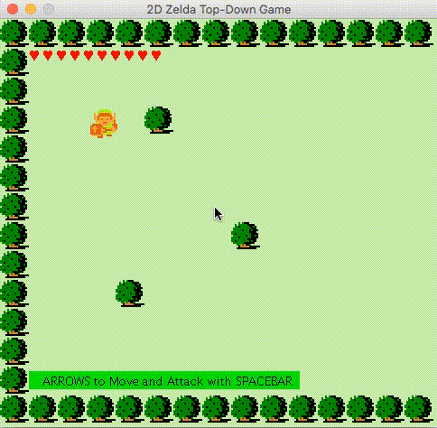

# Zelda with Java2d

RPG game like Zelda using Java2d.


## Prerequires

1. Git 2.6+
2. Maven 3.3+
3. Java 8+


## How to Play

Clone

```
git clone https://github.com/humbertodias/game-zelda-java2d.git
```

Inside the folder

```
cd game-zelda-java2d
```

Run

```
mvn package exec:java -Dexec.mainClass="zelda.java2d.Main"
```


## Output



## References

1. Sprites of **The Legend of Zelda** used on GameBoy

	[http://www.spriters-resource.com](http://www.spriters-resource.com/game_boy_advance/wariowareincmegamicrogames/sheet/59247/)

