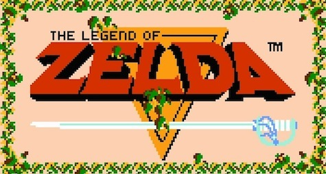

# Zelda with Java2d

RPG demo game like **Legend of Zelda** from NES at **1986** using Java2d.




## Prerequires

1. Git 2.6+
2. Maven 3.3+
3. Java 8+


## How to Play

Clone

```
git clone https://github.com/humbertodias/game-zelda-java2d.git
```

Inside the folder

```
cd game-zelda-java2d
```

Run

```
mvn package exec:java -Dexec.mainClass="zelda.java2d.Main"
```


## Output


## References

1. Sprites of **The Legend of Zelda**

	[http://www.spriters-resource.com](http://www.spriters-resource.com/game_boy_advance/wariowareincmegamicrogames/sheet/59247/)

2. Sound Track of Zelda from NES

	[http://downloads.khinsider.com/game-soundtracks](http://downloads.khinsider.com/game-soundtracks/album/the-legend-of-zelda-nes-)
	
3. Wiki

	[http://www.vgmpf.com/Wiki](http://www.vgmpf.com/Wiki/index.php?title=The_Legend_of_Zelda_(NES))